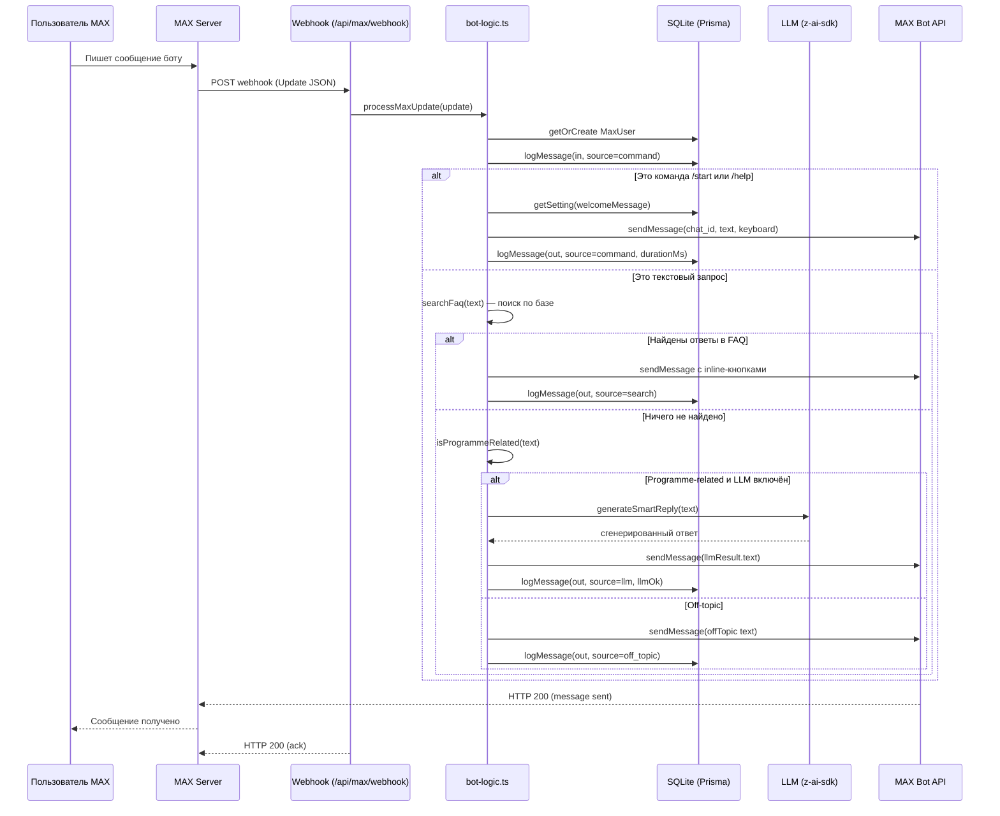
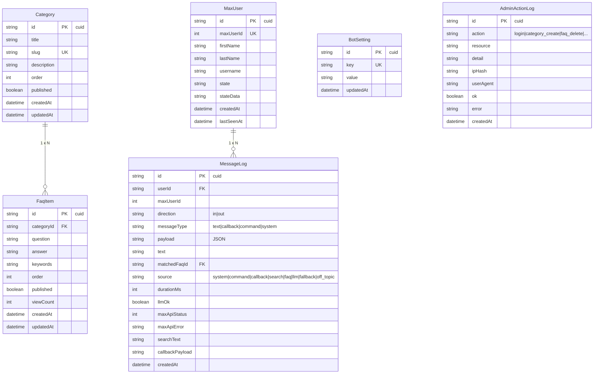

# 🏗️ Архитектура

Версия 1.3 · Чат-бот MAX для программы "Обучение служением. Первые"

## Обзор

Система построена по принципам **serverless-first** с Next.js App Router. Frontend и backend живут в одном приложении, что упрощает разворачивание и поддержку. База данных — SQLite (без внешних зависимостей), что идеально для небольшой школы/организации.

### Высокий уровень

```mermaid
graph TB
    subgraph MAX[Мессенджер MAX]
        U1[Пользователь 1]
        U2[Пользователь 2]
        U3[Пользователь 3]
    end

    subgraph Bot[Next.js App]
        WH[/api/max/webhook]
        LOGIC[bot-logic.ts]
        DB[(SQLite<br/>Prisma)]
        LLM[z-ai-web-dev-sdk<br/>LLM fallback]
        API[MAX Bot API client]
    end

    subgraph MAXAPI[platform-api2.max.ru]
        SEND[POST /messages]
        SUB[POST /subscriptions]
        ME[GET /me]
    end

    subgraph Admin[Админ-панель]
        A1[Браузер<br/>администратора]
        A2[Браузер<br/>сотрудника]
    end

    U1 & U2 & U3 -->|сообщения| MAX
    MAX -->|webhook events| WH
    WH --> LOGIC
    LOGIC --> DB
    LOGIC --> LLM
    LOGIC --> API
    API --> SEND
    SEND -->|ответы| MAX
    MAX --> U1 & U2 & U3

    A1 & A2 -->|HTTP| Bot
    Bot --> A1 & A2
    A1 -->|подписка webhook| SUB
```

### Поток обработки входящего сообщения



---

## Стек технологий

| Уровень | Технология | Назначение |
|---------|------------|------------|
| Framework | Next.js 16 (App Router) | Backend API + frontend в одном приложении |
| Язык | TypeScript 5 | Типобезопасность |
| ORM | Prisma 6 | Работа с SQLite |
| БД | SQLite (file-based) | Хранение данных, без внешних сервисов |
| UI | shadcn/ui (New York style) | Готовые компоненты |
| Styling | Tailwind CSS 4 | Адаптивный дизайн |
| Icons | lucide-react | Иконки в UI |
| ИИ | z-ai-web-dev-sdk | LLM-фолбэк для запросов без совпадения в FAQ |
| Auth | Cookie-сессии (custom) | Простая аутентификация админ-панели |
| Validation | Zod | Схемы валидации (готово к использованию) |

---

## Схема базы данных

Всего **6 моделей**:



### Связи

- **Category → FaqItem**: одна категория содержит много FAQ-ответов. При удалении категории каскадно удаляются все её FAQ (onDelete: Cascade).
- **MaxUser → MessageLog**: один пользователь имеет много записей в журнале сообщений. При удалении пользователя каскадно удаляются все его логи.
- **FaqItem → MessageLog.matchedFaqId**: опциональная ссылка — указывает, какой FAQ был показан пользователю.

### Индексы

- `MessageLog.userId`, `MessageLog.maxUserId`, `MessageLog.createdAt`, `MessageLog.direction`, `MessageLog.source` — для быстрых запросов в аналитике
- `AdminActionLog.action`, `AdminActionLog.createdAt` — для фильтров audit log
- `FaqItem.categoryId` — для выборки FAQ категории
- `MaxUser.maxUserId` (unique) — для быстрого поиска по ID из MAX

---

## Структура каталогов исходного кода

```
src/
├── app/
│   ├── api/                      # 18 API endpoints (см. API_REFERENCE.md)
│   │   ├── auth/                 # /login, /logout, /me
│   │   ├── categories/           # CRUD
│   │   ├── faqs/                 # CRUD
│   │   ├── settings/             # GET/PUT
│   │   ├── stats/                # метрики для дашборда
│   │   ├── analytics/            # comprehensive analytics
│   │   ├── admin-actions/        # audit log + /export CSV
│   │   ├── logs/                 # message log + /export CSV
│   │   ├── knowledge/            # JSON export/import
│   │   ├── users/[id]/           # история диалога пользователя
│   │   ├── max/                  # webhook, subscribe, bot-info, test-send, register-commands
│   │   └── health/               # health-check (без авторизации)
│   ├── layout.tsx                # Метаданные, шрифты, Toaster
│   └── page.tsx                  # Главная: login + admin panel с sidebar
│
├── components/
│   ├── admin/
│   │   ├── login-screen.tsx
│   │   ├── dashboard-view.tsx
│   │   ├── analytics-view.tsx
│   │   ├── unanswered-view.tsx
│   │   ├── audit-view.tsx
│   │   ├── categories-view.tsx
│   │   ├── faqs-view.tsx
│   │   ├── faq-create-dialog.tsx
│   │   ├── logs-view.tsx
│   │   ├── settings-view.tsx
│   │   └── user-history-dialog.tsx
│   └── ui/                       # shadcn/ui компоненты (button, card, dialog, ...)
│
└── lib/
    ├── db.ts                     # Prisma client singleton
    ├── max-api.ts                # MAX Bot API client (sendMessage, webhook, etc.)
    ├── bot-logic.ts              # Обработка событий: bot_started, callback, message
    ├── llm.ts                    # z-ai-web-dev-sdk + isProgrammeRelated (STRONG/WEAK)
    ├── auth.ts                   # Cookie-сессии
    ├── admin-log.ts              # logAdmin helper для аудита
    ├── api-client.ts             # Thin fetch wrapper для клиентского кода
    └── format.ts                 # timeAgo, formatDurationMs, formatDateTime
```

---

## Ключевые компоненты

### 1. Webhook endpoint (`/api/max/webhook`)

Принимает POST-запросы от MAX с Update JSON-объектом. Типы Update:
- `bot_started` — пользователь запустил бота
- `message_created` — новое текстовое сообщение
- `message_callback` — нажатие на inline-кнопку
- (другие типы логируются, но не обрабатываются)

Response должен быть `200 OK` — иначе MAX повторит запрос.

### 2. Bot logic (`lib/bot-logic.ts`)

Главная функция `processMaxUpdate(update)` — диспетчер:
1. Создаёт/обновляет запись о пользователе в `MaxUser`
2. Логирует входящее сообщение в `MessageLog` (direction=in)
3. Маршрутизирует по update_type:
   - `bot_started` → приветствие + клавиатура категорий
   - `message_callback` → парсинг payload (home/help/search/cat:{id}/faq:{id}/contact_human)
   - `message_created` → проверка команд /start /help, иначе поиск по FAQ
4. Если FAQ-поиск нашёл → кнопки с вариантами (source=search)
5. Если не нашёл и programme-related → LLM-фолбэк (source=llm)
6. Если не нашёл и off-topic → fallback-сообщение (source=off_topic или fallback)
7. Отправляет ответ через MAX API
8. Логирует исходящее сообщение (direction=out) с durationMs, maxApiStatus

### 3. Search FAQ (`searchFaq` в bot-logic.ts)

- Делит запрос на токены, фильтрует стоп-слова (и/а/но/что/the/a/...)
- Минимум 3 символа на слово
- Для каждого FAQ считает score:
  - +1 если слово есть в haystack (question+keywords+answer)
  - +2 если в вопросе
  - +1.5 если в keywords (более релевантно)
- Берёт топ-5 по score

### 4. Off-topic фильтр (`isProgrammeRelated` в lib/llm.ts)

Двухуровневая система (v1.2):
- **STRONG_TERMS** — уникальные для программы слова (служение, добро.рф, росмолодёж, просветительск, etc.) — любое совпадение = on-topic
- **WEAK_TERMS** — общие образовательные слова (педагог, наставник, школ, студент, etc.) — нужно ≥2 совпадений

### 5. LLM fallback (`generateSmartReply` в lib/llm.ts)

- Загружает все опубликованные FAQ из БД
- Строит системный промпт с базой знаний и жёсткими ограничениями:
  - Отвечать только в рамках базы
  - Не выдумывать факты
  - Если нет ответа — мягко предложить связаться с командой
- Вызывает z-ai-web-dev-sdk chat.completions.create()
- Возвращает { text, source: 'llm', ok }
- Добавляет footer "🏠 Главное меню · ✉️ info@dobro.ru"

### 6. MAX Bot API client (`lib/max-api.ts`)

- Читает токен из `BotSetting.botToken` в БД (или env MAX_BOT_TOKEN)
- Все запросы идут на `https://platform-api2.max.ru/`
- Авторизация: заголовок `Authorization: <access_token>` (НЕ через query-параметры!)
- Лимит: 30 запросов в секунду
- Методы: `sendMessage`, `answerCallback`, `subscribeWebhook`, `getSubscriptions`, `unsubscribe`, `setMyCommands`, `getMe`

### 7. Admin auth (`lib/auth.ts`)

- Cookie `max_bot_admin_session` (httpOnly, 7 дней)
- Пароль проверяется через `verifyPassword(input)` против `ADMIN_PASSWORD` env
- `isAuthenticated()` проверяет наличие cookie в API роутах
- При неудачной попытке входа логируется как `login_failed` с причиной

### 8. Admin audit logger (`lib/admin-log.ts`)

- `logAdmin({ action, resource, detail, ok, error })` — вызывается из всех admin API роутов
- Хранит хеш IP-адреса (SHA-256, 16 символов) — приватно
- Хранит User-Agent для отладки
- Типы действий: login, logout, login_failed, settings_update, bot_token_set, category_create/update/delete, faq_create/update/delete, webhook_subscribe, commands_register, test_send, knowledge_import, knowledge_export, audit_export

---

## Развитие архитектуры (если нужно масштабировать)

### Когда SQLite перестанет хватать

- Много одновременных пользователей (>100 RPS)
- Нужно несколько серверов (stateless)

**Решение**: переключить `prisma/schema.prisma` на PostgreSQL:
```prisma
datasource db {
  provider = "postgresql"
  url      = env("DATABASE_URL")
}
```
Затем `bun run db:push`. Приложение продолжит работать без изменений кода.

### Когда нужен real-time мониторинг

Сейчас логи обновляются через ручной refresh. Можно:
1. Добавить Server-Sent Events (SSE) endpoint `/api/logs/stream`
2. Или WebSocket mini-service (есть в `examples/`)
3. Или polling с интервалом 5s на клиенте

### Когда нужны отчёты по расписанию

- Cron-job через Vercel Cron / GitHub Actions / внешний cron
- Endpoint `/api/reports/daily` возвращает PDF/HTML-отчёт
- Отправка по email через SMTP (потребуется env SMTP_URL)

---

## Безопасность

### Аутентификация
- Cookie-based session (httpOnly, secure в продакшене, sameSite=lax)
- Пароль в env `ADMIN_PASSWORD` (НЕ в коде)
- Все admin API роуты проверяют `isAuthenticated()` в начале
- Неудачные попытки входа логируются

### Секреты
- Токен бота хранится в `BotSetting` в БД, не в env (можно через UI настроек)
- В JSON-бэкап базы знаний токен **не включается** (только welcomeMessage, helpMessage, llmEnabled)
- IP-адреса логируются как SHA-256 хеши (16 символов), не raw

### Webhook
- URL должен быть HTTPS (MAX не поддерживает HTTP с мая 2025)
- Сертификат от доверенного CA (включая сертификаты Минцифры РФ)
- Эндпоинт логирует все входящие события

### Внешние запросы
- MAX Bot API: заголовок `Authorization`, не query-параметр
- z-ai-web-dev-sdk: только на backend, не в client-side коде
- Никаких ключей в URL или client-side JS

---

## Ссылки

- [Разворачивание](./DEPLOYMENT.md) — как установить и настроить
- [API Reference](./API_REFERENCE.md) — все endpoints
- [Решение проблем](./TROUBLESHOOTING.md) — частые проблемы
